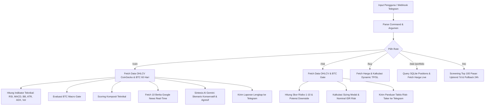

# Dokumentasi Matematis & Analisis Algoritma: Luna Hernandez (Midas Bot)

> **Versi:** 2.1  
> **Status:** Production  
> **Filosofi Inti:** *Deterministic Quantitative Calculation + Synthetic AI Qualitative Reasoning* (Mengadopsi prinsip *Loop Design & Trade Planner*).

---

## 1. Pendahuluan & Filosofi Desain

Bot **Luna Hernandez** dirancang untuk memberikan dukungan pengambilan keputusan (*decision support*) yang objektif, terukur, dan disiplin dalam pasar cryptocurrency. Pasar kripto terkenal memiliki volatilitas ekstrem, sentimen berita yang bising (*noise*), serta bias psikologis trader (seperti FOMO dan *panic selling*).

Untuk mengatasi kelemahan tersebut, arsitektur bot dibangun atas dua pilar yang terpisah secara tegas:

1. **Mesin Kuantitatif Deterministik (JavaScript Core Engine)**  
   Semua kalkulasi angka, indikator teknikal, skor komposit, safety gate makro BTC, dynamic stop loss, target take profit, serta *position sizing* dihitung secara deterministik dan matematis murni. Mesin ini tidak dapat dihalusinasi oleh LLM dan menjamin rasio *Risk-to-Reward* ($R:R$) selalu menguntungkan ($\ge 1 : 2.0$).
2. **Mesin Penalaran Sintetis & Sentimen (Google Gemini 2.5 Flash + Google News Live)**  
   AI tidak diizinkan membuat keputusan beli/jual dari ketiadaan atau menghitung angka sembarangan. AI menerima hasil komputasi deterministik, 10 artikel Google News real-time terbaru, dan histori evaluasi sebelumnya. AI bertugas menguji hipotesis, mendeteksi katalis fundamental, menyajikan skenario pasar (Konservatif vs. Agresif/Risk-Taker), dan memberikan peringatan risiko yang objektif tanpa larangan kaku (*no rigid "dilarang"*).

---

## 2. Diagram Alur Pengambilan Keputusan (Decision Architecture)

---

## 3. Indikator Teknikal & Rumus Matematis

Data mentah dari API CoinGecko berupa pasangan timestamp dan harga `[timestamp, price]` diakumulasi menjadi deret waktu harian (*Daily OHLC*) untuk mengeliminasi *noise intraday*.

### 3.1. Rentang Data & Presisi Desimal Adaptif
1. **Jendela Data 90 Hari (*Warmup Window*):**
   Bot menarik $N = 90$ hari historis (ditingkatkan dari 60 hari) guna menjamin masa pemanasan (*warmup period*) yang memadai bagi kestabilan indikator eksponensial seperti $\text{EMA}_{26}$ pada MACD dan perataan Wilder pada $\text{ADX}_{14}$.
2. **Presisi Desimal Adaptif Sub-Rupiah:**
   Untuk koin meme mikro (seperti PEPE, SHIB) bernilai sub-rupiah, sistem menghindari pembulatan integer `Math.round()`:
   $$\text{fmtPrice}(x) = \begin{cases}
   \text{Rp } 0,xxxx\dots & \text{jika } x < 0.01 \text{ (hingga 8 angka desimal presisi)} \\
   \text{Rp } 0,xxxx & \text{jika } 0.01 \le x < 1 \text{ (4 angka desimal presisi)} \\
   \text{Rp } x,xx & \text{jika } 1 \le x < 100 \text{ (2 angka desimal presisi)} \\
   \text{Rp } \text{format}(\text{round}(x)) & \text{jika } x \ge 100 \text{ (integer dengan pemisah ribuan)}
   \end{cases}$$

### 3.2. Agregasi Candlestick Harian
Untuk setiap hari kalender $d$ dalam rentang data $N$ hari:
$$O_d = \text{Harga pertama pada hari } d$$
$$H_d = \max_{t \in d} (P_t)$$
$$L_d = \min_{t \in d} (P_t)$$
$$C_d = \text{Harga terakhir pada hari } d$$

---

### 3.3. Relative Strength Index (RSI) — Wilder's Smoothed
Digunakan untuk mengukur kecepatan dan perubahan pergerakan harga dalam periode $n = 14$ hari.

1. **Perubahan Harga Harian ($\Delta P_t$):**
   $$\Delta P_t = C_t - C_{t-1}$$
   $$U_t = \begin{cases} \Delta P_t, & \text{jika } \Delta P_t > 0 \\ 0, & \text{jika } \Delta P_t \le 0 \end{cases}$$
   $$D_t = \begin{cases} |\Delta P_t|, & \text{jika } \Delta P_t < 0 \\ 0, & \text{jika } \Delta P_t \ge 0 \end{cases}$$

2. **Rata-Rata Terhalus Wilder (*Wilder's Smoothing*):**
   Untuk $t = n$:
   $$\overline{U}_n = \frac{1}{n} \sum_{i=1}^n U_i, \quad \overline{D}_n = \frac{1}{n} \sum_{i=1}^n D_i$$
   Untuk $t > n$:
   $$\overline{U}_t = \frac{\overline{U}_{t-1} \times (n-1) + U_t}{n}$$
   $$\overline{D}_t = \frac{\overline{D}_{t-1} \times (n-1) + D_t}{n}$$

3. **Relative Strength ($RS$) & Nilai RSI:**
   $$RS_t = \frac{\overline{U}_t}{\overline{D}_t}$$
   $$\text{RSI}_t = 100 - \left( \frac{100}{1 + RS_t} \right)$$

---

### 3.4. Moving Average Convergence Divergence (MACD)
Mengukur momentum tren menggunakan selisih dua Exponential Moving Average (EMA) standar (12, 26) dan garis sinyal (9).

1. **Exponential Moving Average ($\text{EMA}_k$):**
   $$\alpha = \frac{2}{k + 1}$$
   $$\text{EMA}_{k, t} = \alpha \cdot C_t + (1 - \alpha) \cdot \text{EMA}_{k, t-1}$$

2. **Garis MACD, Signal Line, dan Histogram:**
   $$\text{MACD Line}_t = \text{EMA}_{12, t} - \text{EMA}_{26, t}$$
   $$\text{Signal Line}_t = \text{EMA}_{9, t}(\text{MACD Line})$$
   $$\text{Histogram}_t = \text{MACD Line}_t - \text{Signal Line}_t$$

3. **Normalisasi Relatif Histogram:**
   Karena harga koin berbeda secara nominal (BTC vs koin mikro), nilai histogram dinormalisasi terhadap harga penutupan saat ini:
   $$\text{MACD}_{\text{norm}} = \left( \frac{\text{Histogram}_t}{C_t} \right) \times 100\%$$

---

### 3.5. Bollinger Bands (BB 20, 2) & %B
Mengukur volatilitas band dan posisi relatif harga terhadap standar deviasi 20 hari.

1. **Simple Moving Average 20 Hari ($\text{SMA}_{20}$):**
   $$\mu_{20} = \frac{1}{20} \sum_{i=0}^{19} C_{t-i}$$

2. **Standar Deviasi Sampel ($\sigma_{20}$):**
   $$\sigma_{20} = \sqrt{\frac{1}{20} \sum_{i=0}^{19} (C_{t-i} - \mu_{20})^2}$$

3. **Upper Band, Lower Band, dan Bandwidth:**
   $$\text{Upper Band} = \mu_{20} + 2\sigma_{20}$$
   $$\text{Lower Band} = \mu_{20} - 2\sigma_{20}$$
   $$\text{Bandwidth} = \max(\text{Upper Band} - \text{Lower Band}, 10^{-6})$$

4. **Bollinger %B (Posisi Relatif):**
   $$\%B = \frac{C_t - \text{Lower Band}}{\text{Bandwidth}}$$
   - $\%B = 1.0 \implies \text{Harga tepat di Upper Band}$
   - $\%B = 0.5 \implies \text{Harga tepat di Middle Band (SMA20)}$
   - $\%B = 0.0 \implies \text{Harga tepat di Lower Band}$

---

### 3.6. Average True Range (ATR 14)
Mengukur volatilitas absolut pasar dalam satuan mata uang (IDR).

1. **True Range ($TR_t$):**
   $$TR_t = \max \Big( H_t - L_t, \; |H_t - C_{t-1}|, \; |L_t - C_{t-1}| \Big)$$

2. **Nilai ATR 14 Hari:**
   $$\text{ATR}_t = \frac{1}{14} \sum_{i=0}^{13} TR_{t-i}$$

3. **Volatilitas ATR Relatif ($\text{ATR}\%$):**
   $$\text{ATR}\% = \left( \frac{\text{ATR}_t}{C_t} \right) \times 100\%$$

---

### 3.7. Average Directional Index (ADX 14)
Mengukur kekuatan tren terlepas dari arah naik atau turun.

1. **Directional Movement ($+DM$ dan $-DM$):**
   $$\Delta H_t = H_t - H_{t-1}, \quad \Delta L_t = L_{t-1} - L_t$$
   $$+DM_t = \begin{cases} \Delta H_t, & \text{jika } \Delta H_t > \Delta L_t \text{ dan } \Delta H_t > 0 \\ 0, & \text{lainnya} \end{cases}$$
   $$-DM_t = \begin{cases} \Delta L_t, & \text{jika } \Delta L_t > \Delta H_t \text{ dan } \Delta L_t > 0 \\ 0, & \text{lainnya} \end{cases}$$

2. **Directional Indicators ($+DI_{14}$ dan $-DI_{14}$):**
   $$+DI_{14} = 100 \times \frac{\text{Smoothed}(+DM)}{\text{ATR}_{14}}$$
   $$-DI_{14} = 100 \times \frac{\text{Smoothed}(-DM)}{\text{ATR}_{14}}$$

3. **Directional Index ($DX$) & Nilai ADX:**
   $$DX_t = 100 \times \frac{|+DI_{14} - -DI_{14}|}{+DI_{14} + -DI_{14}}$$
   $$\text{ADX}_t = \frac{\text{ADX}_{t-1} \times 13 + DX_t}{14}$$
   - $\text{ADX} < 20 \implies \text{Pasar sideways / Tren lemah}$
   - $\text{ADX} \ge 25 \implies \text{Tren kuat terkonfirmasi}$

---

### 3.8. Historical Volatility (Annualized)
Mengukur volatilitas tahunan berbasis log return:
$$r_t = \ln\left(\frac{C_t}{C_{t-1}}\right)$$
$$\sigma_r = \sqrt{\frac{1}{M-1} \sum_{i=1}^M (r_i - \bar{r})^2}$$
$$\sigma_{\text{ann}} = \sigma_r \times \sqrt{365}$$

---

## 4. Sistem Scoring Komposit (Composite Technical Scoring)

Untuk mengambil keputusan deterministik, kelima pilar indikator digabungkan ke dalam skala terstandarisasi $[-1.0, +1.0]$ dengan pembobotan berikut:

| Indikator | Bobot ($w_i$) | Parameter Inti | Kondisi Skor Maksimum (+1.0) | Kondisi Skor Minimum (-1.0) |
| :--- | :---: | :--- | :--- | :--- |
| **RSI** | $0.25$ | RSI 14-period | Oversold ($< 30$) atau Pullback Sehat ($40 \le \text{RSI} \le 55$ di Uptrend) | Overbought ($> 70$) atau Rebound Gagal di Downtrend |
| **MACD** | $0.30$ | Normalized Histogram | Histogram positif kuat ($\text{MACD}_{\text{norm}} \ge +2\%$) | Histogram negatif tajam ($\text{MACD}_{\text{norm}} \le -2\%$) |
| **Bollinger** | $0.25$ | $\%B$ Posisi Band | Rebound dekat Lower Band / Pullback sehat ($0.15 \le \%B \le 0.40$) | Melekat di Upper Band ($\%B \ge 0.85$) rawan koreksi |
| **Volatilitas** | $0.10$ | Annualized $\sigma_{\text{ann}}$ | Volatilitas rendah & terkompresi ($< 45\%$) | Volatilitas liar tak terkendali ($> 110\%$) |
| **Tren (ADX)** | $0.10$ | $\text{SMA}_{20} \times \text{ADX}$ | $C_t > \text{SMA}_{20}$ dengan $\text{ADX} > 25$ (Uptrend kuat) | $C_t < \text{SMA}_{20}$ dengan $\text{ADX} > 25$ (Downtrend kuat) |

### Formula Skor Komposit:
$$\text{TechnicalScore} = \sum_{i=1}^{5} w_i \cdot s_i$$
di mana $s_i \in [-1.0, +1.0]$.

### Kategori Rekomendasi Awal:
$$\text{Keputusan} = \begin{cases} 
\text{STRONG BUY} & \text{jika } \text{TechnicalScore} \ge +0.50 \\
\text{BUY / ACCUMULATE} & \text{jika } +0.20 \le \text{TechnicalScore} < +0.50 \\
\text{HOLD / NEUTRAL} & \text{jika } -0.20 < \text{TechnicalScore} < +0.20 \\
\text{REDUCE / SELL} & \text{jika } \text{TechnicalScore} \le -0.20
\end{cases}$$

---

## 5. BTC Macro Gate (Safety Filter)

Bitcoin memegang dominasi pasar kripto yang signifikan ($> 55\%$). Ketika tren Bitcoin sedang melemah (*Bearish*), koin altcoin cenderung jatuh lebih dalam (*High Beta Risk*). Oleh karena itu, bot menerapkan filter pengaman makro **BTC Gate**:

1. **Evaluasi Tren Bitcoin:**
   $$\text{BTC Trend} = \begin{cases}
   \text{BULLISH} & \text{jika } C_{\text{BTC}} > \text{SMA}_{20}(\text{BTC}) \text{ dan } \text{Hist}_{\text{MACD}}(\text{BTC}) > 0 \\
   \text{BEARISH} & \text{jika } C_{\text{BTC}} < \text{SMA}_{20}(\text{BTC}) \text{ dan } \text{Hist}_{\text{MACD}}(\text{BTC}) < 0 \\
   \text{NEUTRAL} & \text{kondisi transisi lainnya}
   \end{cases}$$

2. **Dampak BTC Gate Terhadap Altcoin:**
   - Jika **BTC BULLISH**: Altcoin dengan skor teknikal tinggi mendapatkan status rekomendasi penuh (`BUY` / `STRONG BUY`).
   - Jika **BTC BEARISH**:
     - Rekomendasi `BUY` otomatis diturunkan menjadi **`HOLD (BTC BEARISH)`** atau **`WATCHLIST PULLBACK`**.
     - Skor teknikal diberikan penalti kehati-hatian.
     - Rasio target $R:R$ diperketat.
     - Bot memberikan peringatan makro tertulis tanpa menggunakan kata kaku "dilarang".

---

## 6. Dynamic Take Profit & Stop Loss Engine

### 6.1. Masalah Stop Loss Statis & Swing Low Ekstrem
Jika Stop Loss ditentukan secara kaku (misalnya -6%) atau menggunakan titik terendah 14 hari (*Swing Low 14h*) yang berada di level -34%:
- Target Profit +12% dengan Stop Loss -34% menghasilkan rasio $R:R = 1 : 0.35$ (Inversi $R:R$). Ini merupakan strategi buruk yang merugikan modal jangka panjang.
- Sebaliknya, Stop Loss yang terlalu sempit ($< 3\%$) pada koin volatil akan terkena *whipsaw* (terlikuidasi akibat *market noise* sesaat sebelum koin berbalik naik).

### 6.2. Formula Dynamic Exit Luna Hernandez
Bot menggunakan **ATR Relatif ($\text{ATR}\%$)** untuk menetapkan level exit yang adaptif terhadap volatilitas masing-masing koin:

1. **Dynamic Stop Loss Percentage ($\text{SL}\%$):**
   $$\text{SL}_{\text{raw}} = 1.8 \times \text{ATR}\%$$
   $$\text{dynSlPct} = \min\Big(8.5\%, \; \max(4.5\%, \; \text{SL}_{\text{raw}})\Big)$$
   - *Batas Bawah (4.5%):* Mencegah *stop-out* prematur akibat fluktuasi normal koin harian.
   - *Batas Atas (8.5%):* Menjamin batas toleransi risiko modal maksimal tidak pernah melebihi 8.5% per posisi.

2. **Faktor Rasio Risk-to-Reward ($R:R$):**
   $$R:R = \begin{cases}
   2.5 & \text{jika } \text{Trend} = \text{Bullish terkonfirmasi dan } \text{ADX} > 25 \\
   2.0 & \text{pada kondisi standar lainnya}
   \end{cases}$$

3. **Dynamic Take Profit Percentage ($\text{TP}\%$):**
   $$\text{TP}_{\text{raw}} = \text{dynSlPct} \times R:R$$
   $$\text{dynTpPct} = \max\Big(10.0\%, \; \min(25.0\%, \; \text{TP}_{\text{raw}})\Big)$$
   - *Batas Bawah (10.0%):* Memastikan target keuntungan bernilai signifikan terhadap biaya transaksi.
   - *Batas Atas (25.0%):* Mengunci target rasional pada fase *swing trading* (tidak muluk-muluk/berkhayal).

4. **Kalkulasi Level Harga Nominal (IDR):**
   $$\text{Price}_{\text{TP}} = \text{round}\Big( C_t \times (1 + \frac{\text{dynTpPct}}{100}) \Big)$$
   $$\text{Price}_{\text{SL}} = \text{round}\Big( C_t \times (1 - \frac{\text{dynSlPct}}{100}) \Big)$$

> [!NOTE]
> **Jaminan Matematis:** Dengan formula ini, rasio $\frac{\text{dynTpPct}}{\text{dynSlPct}}$ dijamin **selalu $\ge 2.0$**, sehingga trader memiliki keunggulan matematis positif (*positive expectancy*) bahkan dengan *win-rate* 40%.

---

## 7. Kalkulator Risiko & Tactical Sizing (`/risk`)

Fitur `/risk <simbol> [modal]` dirancang khusus untuk membedah profil risiko dari sudut pandang *Risk-Taker* (trader agresif) tanpa bahasa patronizing atau larangan kaku.

### 7.1. Skor Risiko Komposit (Skala 1.0 – 10.0)
Basis skor dimulai dari **5.0**, kemudian disesuaikan berdasarkan variabel risiko aktual:

$$\text{RiskScore} = \text{clamp}\Big( 5.0 + \sum \Delta \text{Risk}, \; 1.0, \; 10.0 \Big)$$

| Faktor Risiko | Kondisi Matematis | Dampak ($\Delta \text{Risk}$) |
| :--- | :--- | :---: |
| **Makro BTC Bearish** | $C_{\text{BTC}} < \text{SMA}_{20} \text{ dan } \text{MACD}_{\text{BTC}} < 0$ | $+2.0$ |
| **Makro BTC Bullish** | $C_{\text{BTC}} > \text{SMA}_{20} \text{ dan } \text{MACD}_{\text{BTC}} > 0$ | $-1.0$ |
| **Overbought Bollinger** | $\%B \ge 0.85$ | $+2.0$ |
| **Falling Knife / Dump** | $\%B \le 0.20 \text{ dan } \text{RSI} < 35$ | $+1.5$ |
| **Zona Pullback Sehat** | $0.25 \le \%B \le 0.50$ | $-1.0$ |
| **Overbought RSI** | $\text{RSI} > 70$ | $+1.5$ |
| **RSI Sehat di Uptrend** | $40 \le \text{RSI} \le 55 \text{ dan } C_t > \text{SMA}_{20}$ | $-1.0$ |
| **Volatilitas Ekstrem** | $\sigma_{\text{ann}} > 85\%$ | $+1.5$ |
| **Volatilitas Tenang** | $\sigma_{\text{ann}} < 45\%$ | $-0.5$ |
| **Downtrend Konfirmasi** | $C_t < \text{SMA}_{20} \text{ dan } \text{Hist}_{\text{MACD}} < 0$ | $+1.5$ |
| **Uptrend Kuat ADX** | $C_t > \text{SMA}_{20}, \; \text{Hist}_{\text{MACD}} > 0, \; \text{ADX} > 25$ | $-1.5$ |

### 7.2. Matriks Alokasi & Position Sizing
Berdasarkan skor risiko akhir, bot memberikan panduan alokasi modal terukur:

| Skor Risiko | Klasifikasi Level | Rekomendasi Alokasi Portofolio | Skenario Tindakan |
| :---: | :---: | :---: | :--- |
| **$8.0 - 10.0$** | **Sangat Tinggi 🔴🔴** | **$3\% – 5\%$** | Hindari *all-in*; spekulasi mikro saja dengan SL ketat |
| **$6.0 - 7.9$** | **Tinggi 🔴** | **$5\% – 10\%$** | Cicil bertahap (DCA 2–3 tahap), tunggu retest support |
| **$4.0 - 5.9$** | **Moderat 🟡** | **$10\% – 15\%$** | Alokasi standar swing trading terukur |
| **$1.0 - 3.9$** | **Rendah (Kondusif) 🟢** | **$15\% – 25\%$** | Kondisi prima; dapat menggunakan alokasi penuh |

### 7.3. Estimasi Potensi Downside & Nominal Risiko (IDR)
Untuk input modal $M$ (default Rp 100.000 atau nominal kustom pengguna):
1. **Downside ke Mean Reversion ($\text{SMA}_{20}$):**
   $$\text{Downside}_{\text{SMA}} = \left( \frac{\text{SMA}_{20} - C_t}{C_t} \right) \times 100\%$$
2. **Downside ke Worst-Case Support (Lower BB):**
   $$\text{Downside}_{\text{BB}} = \left( \frac{\text{Lower Band} - C_t}{C_t} \right) \times 100\%$$
3. **Risiko Kerugian Nominal Maksimal ($\text{Loss}_{\text{IDR}}$):**
   $$\text{Loss}_{\text{IDR}} = \text{round}\left( M \times \frac{\text{dynSlPct}}{100} \right)$$
4. **Potensi Keuntungan Nominal ($\text{Gain}_{\text{IDR}}$):**
   $$\text{Gain}_{\text{IDR}} = \text{round}\left( M \times \frac{\text{dynTpPct}}{100} \right)$$

---

## 8. Manajemen Portofolio, DCA, & Auto-Alert (Siklus 30 Menit)

### 8.1. Kalkulasi PnL Posisi Aktif
Untuk setiap posisi terbuka di SQLite:
$$\text{PnL}\% = \left( \frac{P_{\text{current}} - P_{\text{avg}}}{P_{\text{avg}}} \right) \times 100\%$$
$$\text{PnL}_{\text{IDR}} = M_{\text{total}} \times \left( \frac{\text{PnL}\%}{100} \right)$$

### 8.2. Dollar-Cost Averaging (Unit-Weighted Harmonic Average)
Jika pengguna menambah alokasi modal pada koin yang sudah ada (`/buy <simbol> [modal]` ulang), harga beli rata-rata dihitung menggunakan rata-rata terbobot unit (*unit-weighted harmonic average*), bukan rata-rata harga aritmatika:
$$Q_{\text{lama}} = \frac{M_{\text{lama}}}{P_{\text{lama}}}, \quad Q_{\text{baru}} = \frac{M_{\text{baru}}}{P_{\text{baru}}}$$
$$Q_{\text{total}} = Q_{\text{lama}} + Q_{\text{baru}}$$
$$M_{\text{total}} = M_{\text{lama}} + M_{\text{baru}}$$
$$P_{\text{avg, baru}} = \frac{M_{\text{total}}}{Q_{\text{total}}} = \frac{M_{\text{lama}} + M_{\text{baru}}}{\frac{M_{\text{lama}}}{P_{\text{lama}}} + \frac{M_{\text{baru}}}{P_{\text{baru}}}}$$

> **Catatan Integritas Matematis:**  
> Formula aritmatika sederhana $(P_1 M_1 + P_2 M_2) / (M_1 + M_2)$ adalah kekeliruan matematis karena mengalikan harga dengan modal (menghasilkan dimensi harga $\times$ uang yang tidak bermakna). Dalam bursa riil, harga rata-rata selalu merupakan total uang tunai yang dibelanjakan dibagi total kuantitas unit aset yang dimiliki ($M_{\text{total}} / Q_{\text{total}}$).

Sistem mengklasifikasikan transaksi DCA ke dalam buku besar (*ledger*):
- **`DCA_AVERAGE_DOWN`**: jika $P_{\text{baru}} < P_{\text{lama}}$ (menurunkan harga pokok saat harga terkoreksi).
- **`DCA_AVERAGE_UP`**: jika $P_{\text{baru}} \ge P_{\text{lama}}$ (menambah posisi saat tren menguat / *pyramiding*).
Level Dynamic TP dan Dynamic SL secara otomatis dikalibrasi ulang terhadap $P_{\text{avg, baru}}$.

### 8.3. Evaluasi Alert Otomatis & State Machine Anti-Spam (Siklus 30 Menit)
Setiap 30 menit, cron job `manage_positions.mjs check-alerts` mengambil harga pasar live via CoinGecko:
1. **Trigger Alert TP/SL:**
   - Jika $P_{\text{current}} \ge \text{Price}_{\text{TP}}$ dan alert belum dikirim (atau telah di-*re-arm*): Notifikasi **TARGET PROFIT TERCAPAI 🎯** dikirimkan ke Telegram, dan kolom `tp_alerted_at` dicatat dengan timestamp ISO saat ini.
   - Jika $P_{\text{current}} \le \text{Price}_{\text{SL}}$ dan alert belum dikirim (atau telah di-*re-arm*): Notifikasi **STOP LOSS TERPACU 🛑** dikirimkan ke Telegram, dan kolom `sl_alerted_at` dicatat dengan timestamp ISO saat ini.
2. **Mekanisme Re-arming (Hysteresis 2%):**
   - Alert TP di-*re-arm* (flag `tp_alerted_at` direset ke null) hanya jika harga terkoreksi kembali $\ge 2\%$ di bawah level TP ($P_{\text{current}} < \text{Price}_{\text{TP}} \times 0.98$).
   - Alert SL di-*re-arm* (flag `sl_alerted_at` direset ke null) hanya jika harga pulih kembali $\ge 2\%$ di atas level SL ($P_{\text{current}} > \text{Price}_{\text{SL}} \times 1.02$).
   - Mekanisme ini mengeliminasi *spam loop* notifikasi setiap 30 menit ketika harga berkonsolidasi di sekitar batas TP atau SL.

### 8.4. Realisasi Parsial & Audit Ledger (`position_transactions`)
Mendukung perintah partial sell `/sell <simbol> [porsi]` (contoh: `/sell tia 50%`):
1. **Kuantitas Dijual:** $Q_{\text{jual}} = Q_{\text{aktif}} \times \text{porsi}$.
2. **Modal Terealisasi:** $M_{\text{realized}} = M_{\text{aktif}} \times \text{porsi}$.
3. **Hasil Penjualan (Proceeds):** $\text{Proceeds} = Q_{\text{jual}} \times P_{\text{current}}$.
4. **Realized PnL:** $\text{PnL}_{\text{IDR}} = \text{Proceeds} - M_{\text{realized}}$.
5. **Pembaruan Posisi Aktif:**
   - $Q_{\text{sisa}} = Q_{\text{aktif}} - Q_{\text{jual}}$
   - $M_{\text{sisa}} = M_{\text{aktif}} - M_{\text{realized}}$
   - Harga rata-rata ($P_{\text{avg}}$) tidak berubah karena posisi hanya dikurangi sebagian.
   - Jika sisa kuantitas $\le 0$, status posisi ditutup (`closed`).
6. **Audit Ledger Permanen (`position_transactions`):**
   Setiap transaksi (`BUY_INITIAL`, `DCA_AVERAGE_DOWN`, `DCA_AVERAGE_UP`, `PARTIAL_SELL`, `CLOSE_SELL`) dicatat secara permanen dengan mencatat `position_id`, `type`, `price`, `amount_idr`, `quantity`, `realized_pnl_idr`, `realized_pnl_pct`, dan `created_at`.

---

## 9. Kesimpulan & Komitmen Integritas Sistem

1. **Konsistensi Total:** Angka yang keluar pada menu `/coin`, `/risk`, `/buy`, dan `/rec` berasal dari formula dan basis data kuantitatif yang sama.
2. **Keadilan Rasio:** Tidak ada rekomendasi entry yang memiliki rasio $R:R < 1 : 2.0$.
3. **Objektivitas:** Risiko disajikan secara transparan dengan kalkulasi nominal rupiah, sehingga keputusan akhir tetap berada di bawah kendali trader sepenuhnya.
